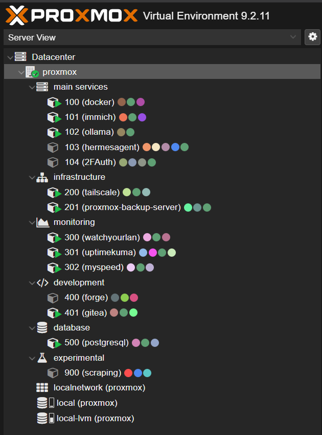

# pve-category

Group Proxmox VE's VM/CT resource tree into custom categories, driven by a
simple JSON config. No manual JS editing, and it survives Proxmox package
upgrades automatically.



## The problem

Proxmox's resource tree just lists every VM/CT flat, sorted by ID. There's
no built-in way to group them into folders like "infrastructure",
"monitoring", "databases", etc.

This project patches the web UI's client-side file (`pvemanagerlib.js`) to
add that grouping. But that file belongs to the `pve-manager` package, so
**any `pve-manager` upgrade overwrites it and wipes the patch** — even a
small point release, not just a major version jump. This project handles
that automatically: an apt hook detects when the patch has been wiped and
reinstalls it right away, with no manual steps.

## Requirements

- Proxmox VE 9.x (tested on `pve-manager` 9.2.11)
- Root access
- `node` available on the host (used to validate the patched file before writing it)

## Install

```bash
git clone https://github.com/galihjulianto/pve-category.git
cd pve-category
chmod +x install.sh
./install.sh
```

This installs:
- `pve-category` → `/usr/local/sbin/pve-category`
- the apt auto-reinstall hook → `/usr/local/sbin/` and `/etc/apt/apt.conf.d/`

Use `./install.sh --no-hook` if you'd rather skip the auto-reinstall hook
and re-run `pve-category install` manually after upgrades instead.

Then set up your categories and apply the patch:

```bash
cp config/pve-ui-categories.example.json /root/pve-ui-categories.json
nano /root/pve-ui-categories.json    # edit to match your VM/CT layout
pve-category install
pve-category status                  # confirms hooks are active
```

## Usage

| Command | What it does |
|---|---|
| `pve-category install` | First-time patch of `pvemanagerlib.js` |
| `pve-category apply` | Re-apply the category block after editing the JSON config |
| `pve-category status` | Show whether hooks are installed, and the current config |
| `pve-category rollback` | Restore the file to its original, pre-install state |
| `pve-category ensure` | Reinstall hooks only if missing (used automatically by the apt hook) |

## Config format

`/root/pve-ui-categories.json`:

```json
{
  "main services": {
    "order": 1,
    "icon": "fa fa-server",
    "ids": [],
    "ranges": [[100, 199]]
  },
  "experimental": {
    "order": 6,
    "icon": "fa fa-flask",
    "ids": [101, 250],
    "ranges": [[900, 999]]
  }
}
```

- `order` — display order in the tree.
- `icon` — a Font Awesome class string.
- `ranges` — inclusive `[start, end]` VMID ranges assigned to this category.
- `ids` — specific VMIDs to include outside of any range.

If the same VMID matches more than one category, `apply`/`install` will
report the overlap.

## How the auto-reinstall hook works

1. `DPkg::Pre-Install-Pkgs` runs a check that reads the list of packages in
   the current dpkg transaction, and marks a flag file if `pve-manager` is
   one of them.
2. `DPkg::Post-Invoke` checks that flag after the transaction finishes
   (i.e. after the new file is already on disk), and if it's set, runs
   `pve-category ensure` to detect the wipe and reinstall the hooks.

This never causes an `apt upgrade` to report failure: `ensure` treats
"hooks already fine" and "pve-category isn't set up on this host" as normal,
no-op outcomes.

## Compatibility and safety

The script matches specific code anchors inside `pvemanagerlib.js`. If a
Proxmox version changes that code's shape, `install`/`apply`/`ensure` will
detect the mismatch and **abort without writing anything to disk** — it
won't produce a broken file. A backup of the original (pre-install) file is
always kept, and every `apply`/`install` also validates the result with
`node --check` before it's written.

If anchors fail to match on a `pve-manager` version you're using, please
open an issue with the version number.

## Prior art

Patching `pvemanagerlib.js` isn't a new idea. [Meliox/PVE-mods](https://github.com/Meliox/PVE-mods),
for example, adds sensor readings to the node view, and notes that Proxmox
upgrades may overwrite the mod and require manual reinstallation. Other
one-off gists patch things like sort order or UI width, usually via a
single `sed`/diff applied once.

What's different here: a config-driven category system instead of a single
hardcoded tweak, anchor + syntax validation before every write, a full
install/apply/status/rollback/ensure command set with backups, and
automatic reinstallation after package upgrades via an apt hook.

## License

MIT

## Disclaimer

This patches an internal, undocumented file that's part of Proxmox VE
itself, not a supported extension point. It validates before every write
and keeps backups, but you're still modifying vendor-owned files. Use at
your own risk, and test on a non-production node first if you can.
